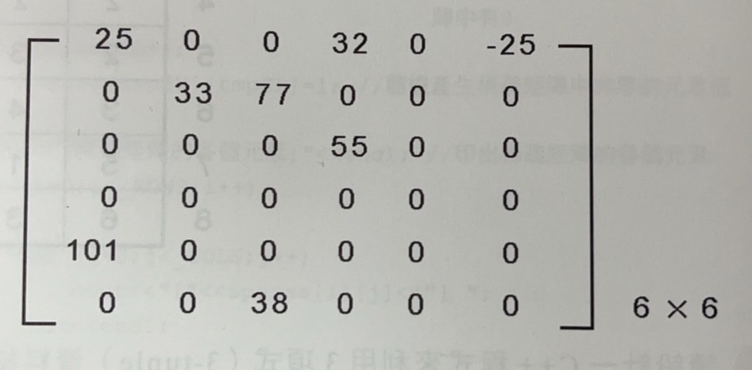

# 2-1線性串列

## 結構
按照記憶體儲存的方式，可以分成兩種：

- Static Data Structure \
  或稱為**密集串列 (dense list)**，使用**連續記憶空間 (Contiguous Allocation)**來儲存。其記憶體配置是在編譯時，就必須宣告最大可能的固定記憶空間，容易造成記憶體的浪費，EX. array
  * 優點：設計簡單，讀取及修改串列中任一元素的時間都固定
  * 缺點：刪除或加入資料，需要移動大量的資料

- Dynamic Data Structure \
  又稱為**鏈結串列 (linked list)**，不使用連續記憶體來儲存
  * 優點：資料的插入或刪除都相當方便，不需要移動大量資料，且由於其記憶體配置是在執行時才發生，所以不需事先宣告，能節省記憶體
  * 缺點：設計其結構較為麻煩，搜尋資料內容也只能透過循序方法

# 2-3 Matrix

## 稀疏矩陣 (Sparse Matrix)
一個矩陣中，大部分元素為 0
